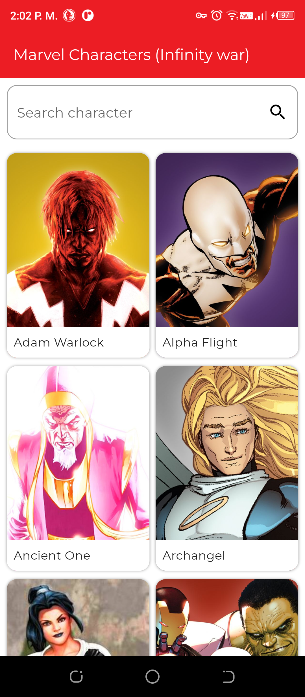
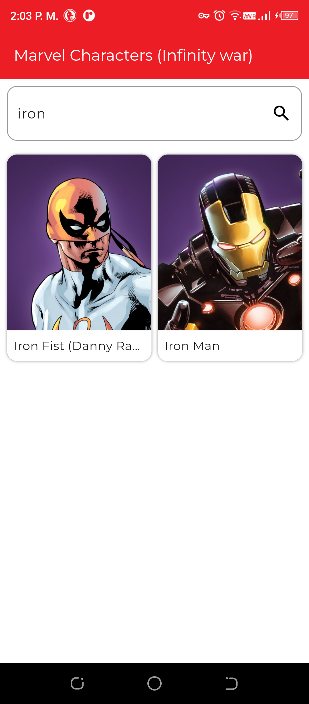
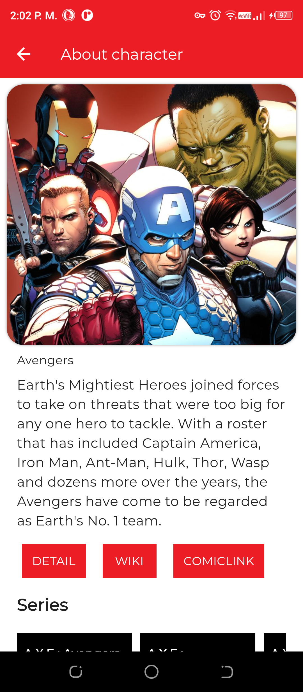

# Proyecto de Consumo de API de Marvel en Flutter

Este proyecto es una aplicación móvil desarrollada en Flutter que consume el API de Marvel para mostrar información sobre sus personajes del evento Infinity War.

## Plugins Utilizados

1. **go_router: ^10.0.0**
   - Un paquete de enrutamiento para una navegación más sencilla y declarativa.

2. **dio: ^5.3.0**
   - Realiza peticiones HTTP de forma sencilla y eficiente para interactuar con el API de Marvel.

3. **flutter_bloc: ^8.1.3**
   - Proporciona una arquitectura basada en BLoCs para gestionar el estado de la aplicación.

4. **flutter_hooks: ^0.20.0**
   - Permite utilizar Hooks para gestionar el estado de los widgets de manera eficiente.

5. **google_fonts: ^5.1.0**
   - Facilita el uso de fuentes de Google para mejorar el aspecto visual de la app.

6. **get_it: ^7.6.0**
   - Librería de inyección de dependencias para gestionar la creación y acceso a instancias de clases.

7. **awesome_dio_interceptor: ^1.0.0**
   - Ofrece interceptores para el paquete dio, permitiendo agregar lógica a las peticiones HTTP.

8. **cached_network_image: ^3.2.3**
   - Carga y cachéa imágenes de la web de manera eficiente para mejorar el rendimiento.

9. **url_launcher: ^6.1.12**
   - Permite abrir enlaces externos desde la aplicación.

10. **mockito: ^5.4.2**
   - Simplifica las pruebas unitarias mediante la creación de objetos simulados 

## Instrucciones de Ejecución

1. Asegúrate de tener Flutter instalado en tu sistema.
2. Clona este repositorio en tu máquina local.
3. Ejecuta el comando `flutter pub get` para instalar las dependencias necesarias.
4. Conecta tu dispositivo móvil o emulador.
5. Ejecuta el comando `flutter run` para iniciar la aplicación.

## Contribuciones

Contribuciones son bienvenidas. Abre un "Issue" o envía una "Pull Request" con tus cambios.

## Atribuciones

Este proyecto utiliza el API de Marvel. Todos los datos y recursos pertenecen a Marvel y están sujetos a sus términos de uso.

## Capturas

## Proyecto Original
Este proyecto se basa en el siguiente proyecto de GitHub, el cual sirvió como referencia y punto de partida para su desarrollo:
[Flutter-Bloc-Marvel-App](https://github.com/Ansh-Rathod/Flutter-Bloc-Marvel-App.git)